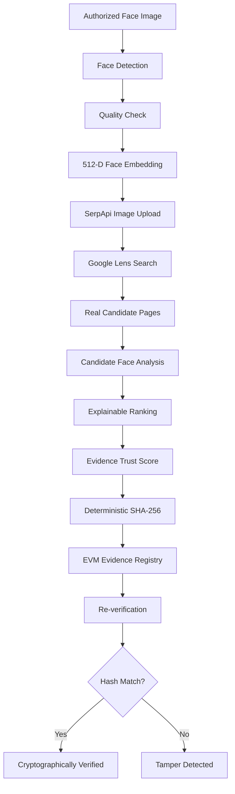

# FaceProof

**DISCOVER. VERIFY. PROVE.**

FaceProof is an AI-powered digital evidence discovery and provenance platform. It accepts an authorized face image, performs face analysis and genuine reverse-image discovery, compares accessible candidates, creates a deterministic SHA-256 evidence fingerprint, and supports later integrity verification through an EVM evidence registry.

> FaceProof does not just find a match. It creates a verifiable evidence trail from discovery to cryptographic proof.

## What It Proves

Face similarity can identify potentially related visual evidence; it does not prove a person's identity. Blockchain is used to verify the integrity and provenance of a registered evidence fingerprint, not to establish identity.

Use FaceProof only with authorized and consented imagery. It is not intended for mass surveillance or unauthorized identity tracking.

## Core Pipeline



## Features

- Real face detection, quality analysis, landmarks, and InsightFace embeddings.
- One-primary-face validation with clear no-face and multiple-face errors.
- Genuine SerpApi Google Lens reverse-image search when `SERPAPI_API_KEY` is configured.
- Actual provider search ID, timestamp, candidate count, and processing duration.
- Candidate image download and face comparison when a result image is accessible.
- Explicit candidate states such as analyzed, image unavailable, and analysis failed.
- Explainable candidate ranking using only available calculated signals.
- `Not available` display for signals that could not be calculated.
- No reliable match handling; unsupported candidates cannot be registered as evidence.
- Deterministic SHA-256 evidence fingerprints.
- Real EVM registration through Ethers.js when blockchain configuration is present.
- Integrity verification and controlled local tamper simulation.
- Investigation timeline with processing events and measured durations.
- Blockchain registry, verification, history, certificate, settings, and evaluation views.

## Current Architecture

```text
FaceProof/
├── server.ts                         Express + Vite entry point
├── src/                              React frontend
│   ├── App.tsx                       Application state and routing
│   ├── components/                   Shared forensic UI components
│   └── pages/                        Investigation and evidence pages
├── server/
│   ├── routes/api.ts                 REST API routes
│   ├── services/faceEmbedding.ts     FastAPI/InsightFace client
│   ├── services/searchProvider.ts     SerpApi Google Lens integration
│   ├── services/blockchainService.ts Ethers.js evidence registration
│   ├── services/evidenceStore.ts     Current in-memory investigation store
│   ├── face_service.py               FastAPI + OpenCV + InsightFace service
│   └── types.ts                      Backend contracts
├── contracts/
│   └── EvidenceRegistry.sol          Evidence hash registry contract
├── docs/
│   ├── api.md
│   ├── architecture.md
│   └── demo.md
├── public/assets/                    Static assets
├── package.json
├── tsconfig.json
└── vite.config.ts
```

The current investigation store is in memory. Investigations and local records are lost when the Node process restarts. MongoDB is not currently wired into this repository.

## Requirements

- Node.js 20 or newer
- npm
- Python 3.11+ recommended for the InsightFace service
- A SerpApi account and API key for genuine reverse-image search
- An EVM RPC endpoint, dedicated test wallet, and deployed `EvidenceRegistry` contract for blockchain anchoring

## Installation

### 1. Install JavaScript dependencies

```powershell
cd D:\HackerGoa\FaceProof
npm install
```

### 2. Install Python ML dependencies

```powershell
py -m pip install fastapi uvicorn numpy opencv-python insightface onnxruntime python-multipart
```

The first face-service startup downloads the InsightFace `buffalo_sc` model into the local InsightFace model directory.

### 3. Configure environment variables

Create a `.env` file in the project root. Never commit it.

```env
SERPAPI_API_KEY=your_serpapi_key
BLOCKCHAIN_RPC_URL=https://your-evm-rpc.example
BLOCKCHAIN_PRIVATE_KEY=your_dedicated_test_wallet_private_key
CONTRACT_ADDRESS=0xYourDeployedEvidenceRegistryAddress
```

Use a dedicated test wallet on a test network such as Ethereum Sepolia. Never use a production wallet or expose a private key in the frontend.

## Running the Application

### Development

Run from the project directory:

```powershell
cd D:\HackerGoa\FaceProof
npm run dev
```

Open [http://localhost:3000](http://localhost:3000).

If you see `EADDRINUSE`, another FaceProof process already owns port `3000`. Check it first:

```powershell
Get-NetTCPConnection -LocalPort 3000 -State Listen
```

### Production

```powershell
cd D:\HackerGoa\FaceProof
npm run build
$env:NODE_ENV="production"; npm start
```

The production server also listens on port `3000`.

### Validation

```powershell
npm run lint
npm run build
```

## Environment Behavior

### Search

`SERPAPI_API_KEY` is required for genuine Google Lens discovery. If it is missing or the provider fails, the API returns a visible search error. It does not silently create mock candidates.

### Face service

The Node server starts the Python service on port `8001` when it is not already available. The health endpoint reports whether InsightFace is operational:

```text
GET /api/health
```

### Blockchain

Anchoring requires all of the following:

- `BLOCKCHAIN_RPC_URL`
- `BLOCKCHAIN_PRIVATE_KEY`
- `CONTRACT_ADDRESS`

Without them, the application reports that blockchain is not configured. It does not generate fake transaction hashes, blocks, wallet addresses, or confirmation states.

## Investigation Workflow

1. Open **New Investigation**.
2. Upload a JPG, PNG, or WebP image containing one primary face.
3. Click **Analyze & Search**.
4. Review face detection, quality, landmarks, embedding status, and the live search metadata.
5. Review candidate images and their actual analysis states.
6. Open **Matches** to compare candidate evidence and inspect the scoring rationale.
7. Select only a candidate with a qualifying face comparison.
8. Review the deterministic SHA-256 package in **Blockchain Registry**.
9. Anchor the fingerprint on the configured EVM contract.
10. Open **Verification** and run the integrity check.
11. Use **Simulate Evidence Modification** to alter only a local verification copy.
12. Confirm `TAMPER DETECTED`, restore the original package, and verify again.

## Evidence Trust Score

The current ranking service calculates a composite score only when the required signals are available. Face comparison is required before a candidate can qualify for evidence registration.

Signals are not invented to fill the interface. Missing values are displayed as `Not available`.

A high score means the available evidence signals are strong. It does not identify a person and should be reviewed with the source context, image availability, metadata, and investigation purpose.

## Evidence Fingerprinting

The evidence fingerprint is generated from a deterministic canonical package containing values such as:

- Canonical source URL
- Candidate platform and title
- Original discovery timestamp
- Candidate content digest
- Candidate metadata digest
- Calculated face similarity
- Final calculated trust score

The SHA-256 digest is the value registered on-chain. Raw face images and raw embeddings are not written to the contract.

During verification, the original stored discovery values are used. A modified local package produces a different digest and is reported as tampered.

## Smart Contract

`contracts/EvidenceRegistry.sol` stores minimal provenance data:

- `bytes32 evidenceHash`
- Registration timestamp
- Canonical source reference
- Registering address
- Registration block number

It exposes registration, lookup, verification, and enumeration functions and rejects duplicate evidence hashes.

Deploy the contract using your preferred Hardhat or EVM deployment workflow, then set the resulting address in `CONTRACT_ADDRESS`.

## API Overview

All endpoints are rooted at `/api`.

| Method | Endpoint | Purpose |
|---|---|---|
| `GET` | `/api/health` | Node, face-service, search, and blockchain status |
| `POST` | `/api/investigations` | Upload an image and run the investigation pipeline |
| `POST` | `/api/investigations/search` | Investigation search alias used by the frontend |
| `POST` | `/api/face/analyze` | Run face analysis directly |
| `POST` | `/api/matches/compare` | Return candidate comparison details |
| `POST` | `/api/investigations/:id/select-candidate` | Create the evidence package and SHA-256 fingerprint |
| `POST` | `/api/investigations/:id/anchor` | Register a fingerprint on the configured blockchain |
| `POST` | `/api/investigations/:id/verify` | Recalculate and compare the evidence fingerprint |
| `POST` | `/api/investigations/:id/tamper` | Create a local controlled tamper copy |
| `POST` | `/api/investigations/:id/restore` | Restore the original local evidence state |
| `GET` | `/api/investigations` | List current in-memory investigations |
| `GET` | `/api/investigations/:id` | Retrieve one investigation |
| `GET` | `/api/blockchain/records` | Retrieve blockchain records held by the running service |
| `GET` | `/api/system/evaluation` | Return metrics collected from current investigations |

See [docs/api.md](docs/api.md) for more details. Some older examples in that document describe an earlier API shape; the running routes in `server/routes/api.ts` are authoritative.

## Verification States

- **HIGH / POTENTIAL / LOW**: Candidate confidence based on calculated signals.
- **NO RELIABLE MATCH**: No candidate passed the qualification rules.
- **IMAGE UNAVAILABLE**: A result image could not be analyzed.
- **VERIFIED**: Current evidence fingerprint matches the registered fingerprint.
- **TAMPER DETECTED**: Current fingerprint differs from the registered fingerprint.
- **Blockchain not configured**: No real EVM registration can be performed yet.

## Two-Minute Demo Flow

1. Open the dashboard.
2. Upload an authorized face image.
3. Show the real face analysis and quality results.
4. Run SerpApi Google Lens search.
5. Show the provider, search ID, timestamp, and actual candidate count.
6. Compare an accessible candidate and explain the available signals.
7. Generate the deterministic SHA-256 fingerprint.
8. Register it on the configured EVM test network.
9. Run verification and show `CRYPTOGRAPHICALLY VERIFIED`.
10. Run the controlled local tamper simulation.
11. Show `TAMPER DETECTED` with the current and registered hashes.
12. Restore the original package and verify again.

## Security and Privacy

- Use authorized, consented images only.
- Keep `.env` out of version control.
- Never expose SerpApi keys, RPC credentials, or wallet private keys to the frontend.
- Validate MIME type and upload size before processing.
- Do not store raw images or embeddings on-chain.
- Treat face similarity as a decision-support signal, not identity proof.
- Use a dedicated test wallet for demonstrations.
- Review external candidate URLs before relying on them as evidence.

## Limitations

- Search quality depends on SerpApi and Google Lens availability.
- Some candidate images cannot be downloaded or analyzed.
- Social platforms may restrict access or return incomplete metadata.
- Similarity systems can produce false positives and false negatives.
- C2PA or Content Credentials are not currently implemented as a complete service.
- The current investigation store is in memory and is not a production database.
- Blockchain anchoring verifies the registered fingerprint; it does not prove the underlying claim or identity.
- A source URL can disappear after its fingerprint has been registered.

## Future Work

- Persist investigations and evidence records in MongoDB.
- Add a dedicated `ProvenanceService` for C2PA / Content Credentials.
- Add structured validation with Zod, Helmet, CORS policy, and rate limiting.
- Add automated tests for image validation, ranking, hashing, blockchain reads, and tamper detection.
- Add a production deployment configuration for separate frontend, API, ML, and blockchain services.
- Add report export and a richer interactive evidence-chain visualization.

## Documentation

- [Architecture](docs/architecture.md)
- [API documentation](docs/api.md)
- [Demo flow](docs/demo.md)

## License

No license has been selected for this repository yet.
