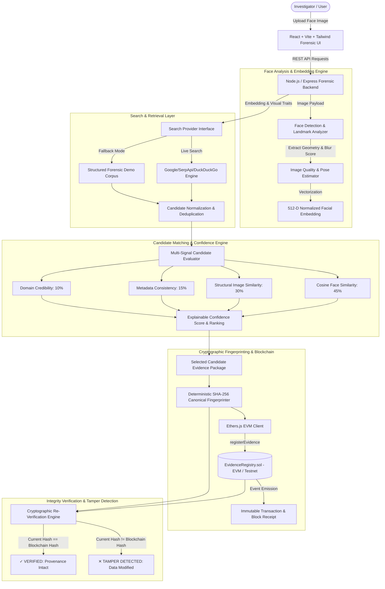
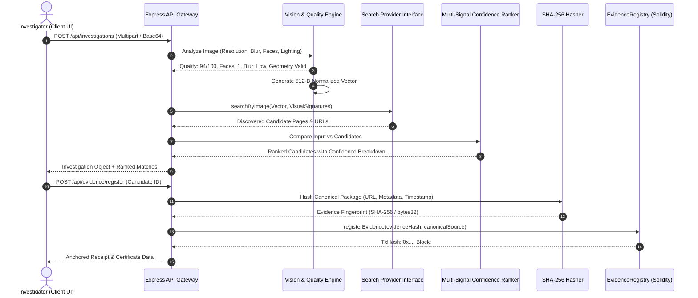

# FACEPROOF Architecture Specification

## 1. System Overview

FaceProof is an enterprise-grade cyber forensics platform that unites computer vision face discovery with immutable blockchain provenance.

## 2. Face Processing Pipeline Flow

## 3. Evidence Verification & Tamper Detection Mechanics

1. **Canonical Evidence Serialization**:
   - `canonicalUrl`: Standardized uniform resource locator
   - `discoveredTimestamp`: ISO-8601 UTC timestamp
   - `candidateContentHash`: SHA-256 of discovered media payload
   - `metadataPayload`: Standardized JSON representation
2. **Cryptographic Fingerprint**:
   $$\text{EvidenceHash} = \text{SHA-256}(\text{canonicalUrl} + \text{discoveredTimestamp} + \text{contentHash} + \text{metadata})$$
3. **Verification**:
   - Query smart contract state on-chain: `getEvidence(evidenceHash)`.
   - If record exists and matches, return status `CRYPTOGRAPHICALLY_VERIFIED`.
   - If evidence fields or content are altered, $\text{SHA-256}(\text{modified}) \neq \text{EvidenceHash}$, triggering `TAMPER_DETECTED`.
